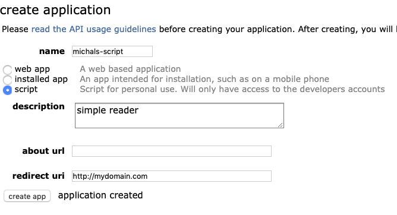
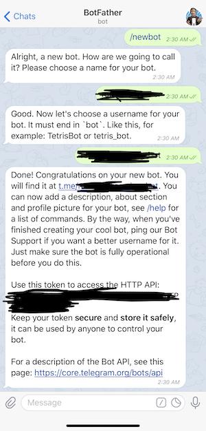

# pydata2019-nlp-system
Source code, materials and notebooks for the workshop @ PyData London 2019 - https://pydata.org/london2019/schedule/presentation/14/

# Welcome!

I hope to see you at the workshop - it'll be exciting and immersive! Follow the preparation steps to make the most of your time.

There are basic steps to get the necessary software, and voluntary extra steps if you're interested.

# Preparation steps

## 1. `git clone` this repository

I will be adding the materials here before the day of the workshop, and that way you can pull the latest version.

> Note: if you are on Windows, I strongly encourage you to use [Git Bash](https://gitforwindows.org), which successfully emulates the basics of the UNIX command line environment on Windows.

## 2. Anaconda Python + `conda env`

You probably already have this ready - please have a recent Anaconda Python installed (ideally Python 3.7)

I have prepared a virtual environment that you can install using conda - this will save you from installing dependencies individually, from affecting your regular environment, and will let us use some powerful packages.  
If you're interested, have a look at `workshop-environment.yml` in this repo!

To make sure you're running the latest version of `conda` and create the environment, navigate to the repository you just cloned and use:
```bash
conda update -n base conda
conda env create -f workshop-environment.yml
```

## 3. Reddit API client ID and client secret

We will be reading message streams from Reddit using a Python client - this requires registering with Reddit to get an ID and secret for our script.

Here are the steps:

- Create a Reddit account (if you don't have one)
- Create an App to be able to use the API - [follow this link](https://www.reddit.com/prefs/apps) and fill in the short form. You need to have a redirect URL, but it can be a fake one.
- Save the client ID (it's visible under your app name) and the secret (easier to spot and comes with a label)

> **hint:** the .env file is protected by git ignore and a good place to save the api credentials.

Here is an example form:



## 4. Telegram messaging app + bot API key

We will be streaming messages to our phones using Telegram, which features a content-rich and flexible interface.

Action steps:
* Download the Telegram mobile (available in the iOS and Android app stores) or [desktop app](https://desktop.telegram.org) and sign up.  

* Start a conversation with `@BotFather` and type the command `/newbot` (you can [read more here](https://core.telegram.org/bots#3-how-do-i-create-a-bot))

* Save the API key (hint: in the .env file)

Here's an example conversation to get an API key:



## 5. Docker for containerization and service orchestration

To easily orchestrate a system of multiple independent services, we will rely on Docker and docker-compose. Please download and install Docker to actively participate in the final part of the workshop. Docker is free, but downloading the Windows and Mac clients requires creating a free account.

Installation:

* Linux - install `docker` or `docker-ce` using your package manager (apt, apk, yum - depending on your distribution)
    * [walkthrough for Ubuntu 18.04](https://www.digitalocean.com/community/tutorials/how-to-install-and-use-docker-on-ubuntu-18-04)
* Windows - [official download](https://hub.docker.com/editions/community/docker-ce-desktop-windows)
* Mac - [official download](https://hub.docker.com/editions/community/docker-ce-desktop-mac)

# Voluntary extra steps

- Bring your ideas for what you want to monitor on Reddit!
- If you want to use your NLP model that you built, that's a wonderful idea!
- Download a pretrained sentiment classification model using the script in `step3_nlp/download_fastai_sentiment_model.sh`
- Pre-build docker images with `cd step6_orchestration && docker-compose build --parallel` - it will take a bit of time, but it's a one-time investment :)

--- 
> **Thank you for taking the preparation steps. See you at the workshop!**  
> *Michal Mucha*